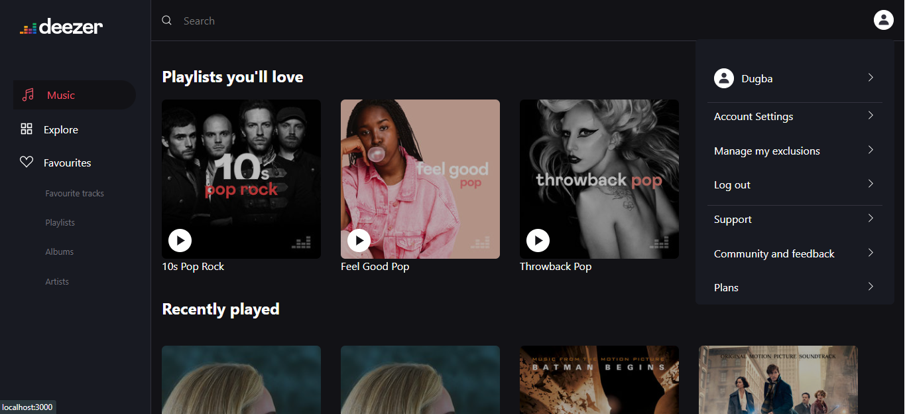
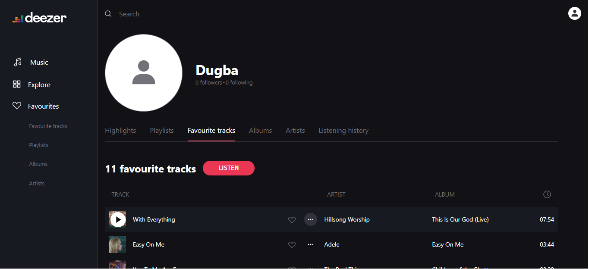
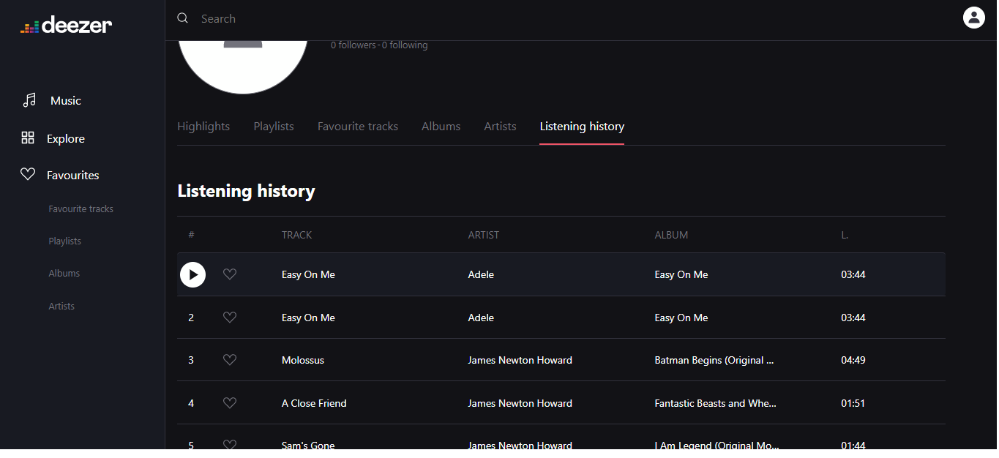
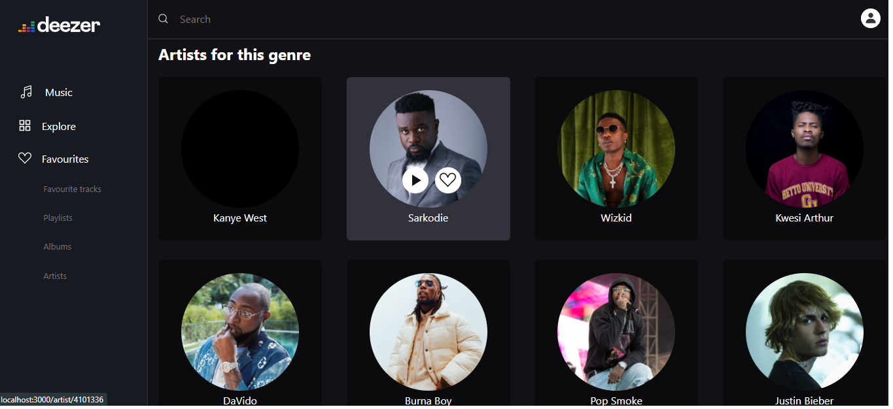
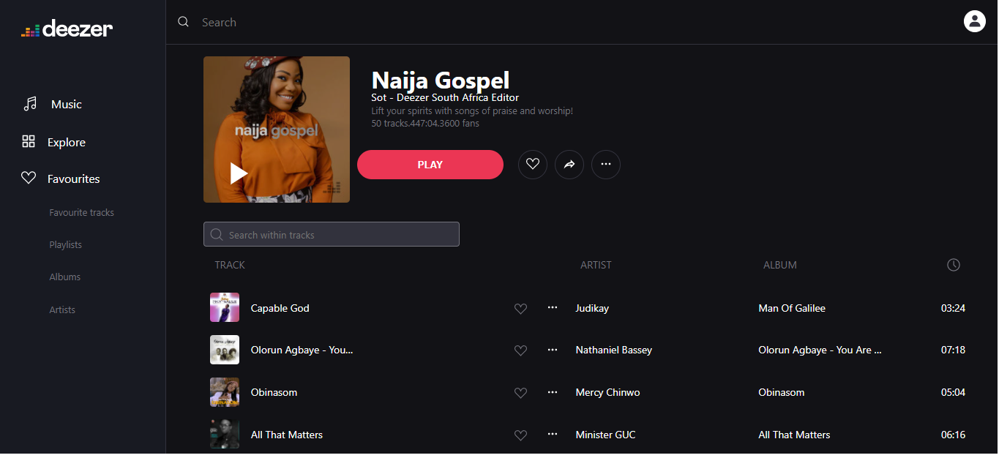

# Overview

This is a my attempt to clone [Deezer](https://deezer.com) streaming web app with their `api`.
It is built with with `Nextjs`, `react-query` and `styled-components`.

### These are some of the pages:

 
 Deezer user profile page
 
  Listening history
 
 Artists for a given genre
 
 Playlists
 

## NB

- The original UI is not the exact same thing as what I currently have. I have taken steps to change some of the UI to have my own version of deezer
- Deezer didn't provide or update some of the apis so the UI is slightly different because I did not get some information to implement the UI design.

## Current implementation

- OAuth2
- Query user and implement user profile page with pagination
- Query user's data such as (favourite songs, artists, playlists etc)
- Query songs and playlists recommendations and editorial picks

## Todo

- Implement contextual search for songs, playlists, artist,podcast
- Sign in with deezer to access deezer personalised information on songs, playlists etc for any logged in user wither their access token
- Abstract reuseable components into storybook design system
- Create(POST) a playlist
- Favourite(POST) a song, artist, playlists, etc
- Unfavourite(DELETE) a song, artist, playlist etc
- Create a custom carousel
- Create a custom deezer music player with their current api
- Clean up files
- Write automated tests

## Application setup

To get started with running this app :

```bash
npm install
# or
yarn 
```

- Create a developer account on [Deezer](https://developers.deezer.com/)
- Create an app on to get your own `appId` and `secret`
- Follow the [docs](https://developers.deezer.com/api/oauth) to generate your access token to make authorized and authenticated requests
- Change the token to yours 
- Navigate to http:// localhost:3000
